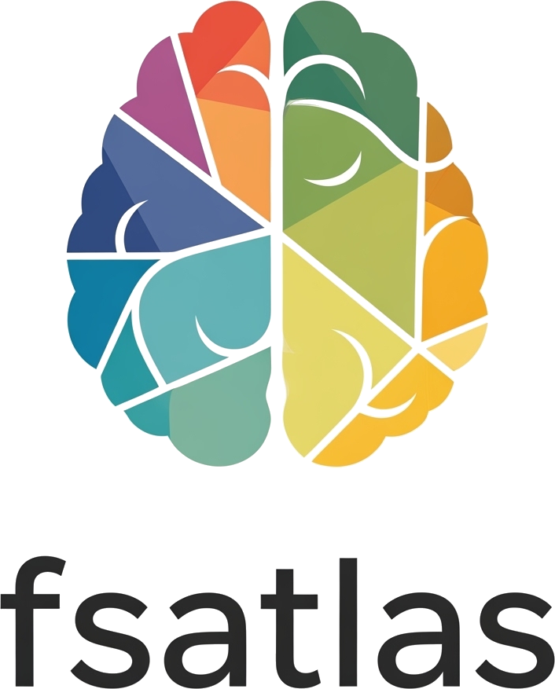

<div align="center">
  
  <h1>fsatlas</h1>
  <p><strong>Automated atlas-based morphometry extraction for FreeSurfer-processed brain MRI</strong></p>

  [](https://pypi.org/project/fsatlas/)
  [](https://pypi.org/project/fsatlas/)
  [](https://opensource.org/licenses/MIT)
  [](https://surfer.nmr.mgh.harvard.edu/)
</div>

---

## The Problem

FreeSurfer's `recon-all` produces cortical statistics for its built-in atlases (Desikan-Killiany, Destrieux, DKT), but extracting measures with any other atlas requires manually chaining together multiple commands:

```
mri_surf2surf → mris_anatomical_stats → parse output
mri_vol2vol   → mri_segstats         → parse output
mri_ca_label  → mri_segstats         → parse output
```

**fsatlas** automates this entire workflow into a single command — for any atlas, for any number of subjects.

---

## Features

- **31 built-in atlases** — Schaefer 2018 (100–1000 parcels × 7/17 networks), Tian 2020 subcortical (Scales I–IV), HCP-MMP1, Brainnetome, AICHA384, Gordon333, AAL116, 4S-156, DKT, Desikan, Destrieux, aseg.
- **Four atlas formats** — `.annot` (FreeSurfer surface), `.nii`/`.nii.gz` (volumetric MNI), `.dlabel.gii` (CIFTI), `.gca` (FreeSurfer GCA).
- **Custom atlas support** — Point at any supported file; provide a LUT TSV for the output schema.
- **LUT-based wide output** — Each row is one region from the atlas LUT; measures are columns. Schema: `subject_id | index | label | hemisphere | measure1 | … | tiv_mm3`.
- **LUT generation** — `fsatlas generate-lut` extracts the embedded colour table from `.annot` files into a reusable TSV.
- **Batch processing** — Process all subjects in `$SUBJECTS_DIR` or a specified list.
- **BIDS output layout** — Optionally write per-subject CSVs in a BIDS derivative directory tree.
- **Failure resilience** — Pipeline continues on per-subject errors; failures logged to a separate TSV.
- **Apptainer and Docker images** — Run without a local FreeSurfer installation; Apptainer recommended for HPC.

---

## Requirements

| Requirement | Version |
|-------------|---------|
| Python | ≥ 3.10 |
| FreeSurfer | 8.x |
| `FREESURFER_HOME` | must be set |
| `SUBJECTS_DIR` | must be set |

Subjects must have completed `recon-all`. CIFTI (`.dlabel.gii`) atlases additionally require FreeSurfer ≥ 7.4 for `mris_convert --dlabel-to-annot`.

---

## Installation

```bash
pip install fsatlas
```

**From source:**

```bash
git clone https://github.com/GalKepler/fsatlas.git
cd fsatlas
pip install -e ".[dev]"
```

---

## Quick Start

### List available atlases

```bash
fsatlas list-atlases
```

### Extract Schaefer 100-parcel cortical stats for all subjects

```bash
fsatlas extract --atlas schaefer100-7 --output-dir ./results
```

### Target specific subjects

```bash
fsatlas extract --atlas schaefer100-7 -s sub-01 -s sub-02 -o ./results
```

### Load subjects from a file

```bash
fsatlas extract --atlas schaefer400-17 --subjects-file subjects.txt -o ./results
```

### Extract subcortical stats with the Tian atlas

```bash
fsatlas extract --atlas tian-s2 -o ./results
```

### Use a custom surface atlas (with LUT)

```bash
# Generate LUT from the .annot colour table
fsatlas generate-lut \
    --lh-annot /path/to/lh.myatlas.annot \
    --rh-annot /path/to/rh.myatlas.annot \
    --output myatlas_lut.tsv

# Extract — provide one hemisphere; the other is auto-detected
fsatlas extract \
    --atlas /path/to/lh.myatlas.annot \
    --lut myatlas_lut.tsv \
    -o ./results
```

### Use a custom volumetric atlas (MNI space)

```bash
fsatlas extract \
    --atlas /path/to/subcortical_atlas.nii.gz \
    --lut /path/to/lut.tsv \
    -o ./results
```

### Use a CIFTI atlas

```bash
fsatlas extract \
    --atlas /path/to/lh.myatlas.dlabel.gii \
    --format dlabel_gii \
    --lut /path/to/lut.tsv \
    -o ./results
```

### Pre-download an atlas

```bash
fsatlas download schaefer400-7
```

### Use BIDS output layout

```bash
fsatlas extract --atlas schaefer100-7 --output-layout bids -o ./derivatives/fsatlas
```

---

## Built-in Atlas Catalog

| ID | Family | Format | Parcels | Space |
|----|--------|--------|---------|-------|
| `schaefer100-7` … `schaefer1000-7` | Schaefer 2018 | annot | 100–1000 | fsaverage |
| `schaefer100-17` … `schaefer400-17` | Schaefer 2018 | annot | 100–400 | fsaverage |
| `tian-s1` … `tian-s4` | Tian 2020 | nifti | 16–54 | MNI152NLin6Asym |
| `hcp-mmp` | HCP-MMP 1.0 | annot | 360 | fsaverage |
| `hcpex_subcortical` | HCP-MMP ext. | nifti | 66 | MNI152NLin2009cAsym |
| `gordon333` | Gordon 2016 | annot | 333 | fsaverage |
| `gordon333_subcortical` | Gordon 2016 | nifti | 52 | MNI152NLin2009cAsym |
| `aicha384` | AICHA 2015 | nifti | 384 | MNI152NLin2009cAsym |
| `aicha384_subcortical` | AICHA 2015 | nifti | 50 | MNI152NLin2009cAsym |
| `aal116` | AAL 2002 | nifti | 116 | MNI152NLin2009cAsym |
| `BN_Atlas` | Brainnetome | annot | 246 | fsaverage |
| `BN_Atlas_subcotex` | Brainnetome | nifti | 36 | MNI152NLin2009cAsym |
| `4s156_subcortical` | 4S-156 | nifti | 56 | MNI152NLin2009cAsym |
| `desikan` | FreeSurfer | annot | 68 | built-in |
| `destrieux` | FreeSurfer | annot | 148 | built-in |
| `dkt` | FreeSurfer | annot | 62 | built-in |
| `aseg` | FreeSurfer | nifti | 49 | built-in |

---

## Output Format

Results are written as wide-format TSV files — one row per region per subject, measures as columns.

**File:** `{atlas}.tsv`

```
subject_id  index  label                hemisphere  thickness_mean_mm  surface_area_mm2  ...  tiv_mm3
sub-01      1      7Networks_LH_Vis_1   lh          2.341              843.0             ...  1458203.0
sub-01      2      7Networks_LH_Vis_2   lh          2.289              700.5             ...  1458203.0
sub-02      1      7Networks_LH_Vis_1   lh          2.311              857.2             ...  1501044.0
```

**Cortical measures** (`.annot`, `.dlabel.gii`): `num_vertices`, `surface_area_mm2`, `gray_matter_volume_mm3`, `thickness_mean_mm`, `thickness_std_mm`, `mean_curvature`, `gaussian_curvature`, `folding_index`, `curvature_index`

**Volumetric measures** (`.nii`, `.gca`): `num_voxels`, `volume_mm3`, `intensity_mean`, `intensity_std`, `intensity_min`, `intensity_max`, `intensity_range`

**Failures** (`{atlas}_failures.tsv`) — subjects that could not be processed, with error messages.

---

## Reading the Output

```python
import pandas as pd

df = pd.read_csv("results/schaefer100-7.tsv", sep="\t")

# Select a specific measure
lh_thickness = df[df["hemisphere"] == "lh"][["subject_id", "label", "thickness_mean_mm"]]

# Subjects × regions matrix
matrix = df.pivot_table(index="subject_id", columns="label", values="thickness_mean_mm")

# eTIV normalization
df["surface_area_norm"] = df["surface_area_mm2"] / df["tiv_mm3"]
```

---

## Containers

**Apptainer** (recommended for HPC/cluster):

```bash
apptainer pull fsatlas.sif docker://galkepler/fsatlas:latest

apptainer run \
    --bind /path/to/SUBJECTS_DIR:/subjects \
    --bind /path/to/license.txt:/license.txt:ro \
    --env SUBJECTS_DIR=/subjects \
    fsatlas.sif \
    --freesurfer-license-file /license.txt \
    extract --atlas schaefer100-7 -o /subjects/results
```

**Docker**:

```bash
docker pull galkepler/fsatlas:latest

docker run --rm \
    -v /path/to/SUBJECTS_DIR:/subjects \
    -v /path/to/license.txt:/opt/freesurfer/license.txt \
    -e SUBJECTS_DIR=/subjects \
    galkepler/fsatlas:latest \
    extract --atlas schaefer100-7 -o /subjects/results
```

Both images are based on `freesurfer/freesurfer:8.0.0` with a self-contained Python environment at `/opt/fsatlas-venv`.

---

## Architecture

```
src/fsatlas/
├── cli/
│   └── main.py           # Click CLI: extract, list-atlases, download, generate-lut
├── atlases/
│   ├── catalog.yaml      # Built-in atlas definitions (31 atlases)
│   ├── *_labels.tsv      # Bundled LUT files for volumetric atlases
│   └── registry.py       # Atlas loading, downloading, LUT generation
└── core/
    ├── bids.py           # BIDS output path construction
    ├── command.py        # run_command() subprocess wrapper
    ├── environment.py    # FreeSurfer detection, subject discovery
    ├── extract.py        # FreeSurfer command runners + .stats file parsers
    ├── formats.py        # Format handler registry (annot, nifti, dlabel_gii, gca)
    ├── lut.py            # LookupTable: from_tsv, from_annot, to_ctab, merge_measures
    └── pipeline.py       # Orchestrator + FlatWriter/BidsWriter
```

**Data flow:**

```
CLI
 └─ resolve atlas + discover subjects
     └─ load LUT (once)
         └─ Pipeline (per subject)
             ├─ validate subject directory structure
             ├─ format handler: transfer atlas → subject space (cached)
             │   ├─ annot:       mri_surf2surf (fsaverage → subject)
             │   ├─ nifti:       mri_vol2vol (MNI → native via talairach.xfm)
             │   ├─ dlabel_gii:  mris_convert → mri_surf2surf
             │   └─ gca:         mri_ca_label (via talairach.m3z)
             └─ format handler: extract stats → raw DataFrame
                 ├─ cortical:   mris_anatomical_stats → 9 measures
                 └─ volumetric: mri_segstats → 7 measures
             └─ LUT.merge_measures → wide-format DataFrame
             └─ OutputWriter (flat → {atlas}.tsv | bids → per-subject CSVs)
```

---

## Development

```bash
pip install -e ".[dev]"
pytest                 # run tests
ruff check src/        # lint
ruff format src/       # format
mypy                   # type check
```

---

## Citation

If you use fsatlas in your research, please cite the relevant atlas papers (shown via `fsatlas list-atlases`) and:

> fsatlas: Automated atlas-based morphometry extraction for FreeSurfer.
> https://github.com/GalKepler/fsatlas

---

## License

MIT © [Gal Kepler](https://github.com/GalKepler)
