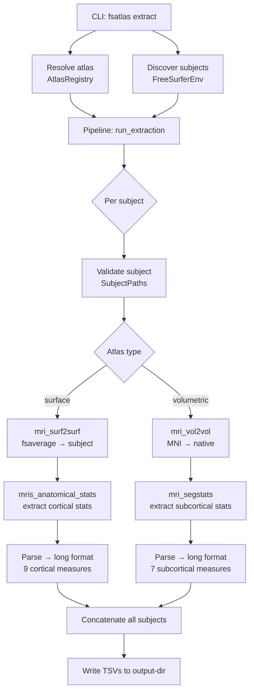

# Architecture

This page describes the internal structure of fsatlas for contributors and users who want to understand how the pipeline works.

---

## Project Layout

```
src/fsatlas/
├── __init__.py              # Package version (0.1.0)
├── cli/
│   ├── __init__.py
│   └── main.py              # Click CLI entry point
├── atlases/
│   ├── __init__.py
│   ├── catalog.yaml         # Built-in atlas definitions
│   └── registry.py          # AtlasRegistry, AtlasSpec, CustomAtlasSpec
└── core/
    ├── __init__.py
    ├── environment.py       # FreeSurferEnv, SubjectPaths
    ├── pipeline.py          # run_extraction() orchestrator
    ├── transfer.py          # mri_surf2surf / mri_vol2vol wrappers
    └── extract.py           # mris_anatomical_stats / mri_segstats + parsing
```

---

## Data Flow



---

## Module Descriptions

### `cli/main.py` — Command-Line Interface

Built with [Click](https://click.palletsprojects.com/). Provides three user-facing commands:

- **`extract`** — Main command; orchestrates the full pipeline.
- **`list-atlases`** — Displays atlas catalog in a Rich table.
- **`download`** — Pre-downloads atlases to the cache.

Responsibilities:
- Calls `FreeSurferEnv.detect()` to find and validate the FreeSurfer installation.
- Calls `AtlasRegistry` to resolve the atlas (catalog lookup or custom file path).
- Discovers subjects from `$SUBJECTS_DIR`, `-s` flags, or `--subjects-file`.
- Delegates to `run_extraction()`.

---

### `atlases/registry.py` — Atlas Registry

Three classes:

**`AtlasSpec`** — A catalog atlas entry loaded from `catalog.yaml`. Properties:
- `cache_dir` — `~/.cache/fsatlas/atlases/{name}/`
- `is_downloaded` — checks if files are present in cache
- `get_file(key)` — returns path to a named file in cache
- `download(force=False)` — downloads all atlas files via HTTP

**`CustomAtlasSpec`** — A user-provided atlas. Stores paths to:
- Surface: `lh_annot`, `rh_annot`
- Volumetric: `nifti_path`

**`AtlasRegistry`** — Loads `catalog.yaml` and manages the catalog. Methods:
- `get(name)` — looks up an `AtlasSpec` by ID
- `list_atlases()` — returns all `AtlasSpec` entries
- `from_custom_surface(lh, rh)` — creates a `CustomAtlasSpec` for surface files
- `from_custom_volumetric(path)` — creates a `CustomAtlasSpec` for a NIfTI file

**Type alias:**
```python
AnyAtlasSpec = AtlasSpec | CustomAtlasSpec
```

---

### `atlases/catalog.yaml` — Atlas Definitions

A YAML file bundled with the package. Each entry specifies:

```yaml
- name: schaefer100-7
  family: Schaefer2018
  description: "100-parcel 7-network Schaefer 2018 atlas"
  type: surface
  space: fsaverage
  source_url: "https://..."
  files:
    lh_annot: lh.Schaefer2018_100Parcels_7Networks_order.annot
    rh_annot: rh.Schaefer2018_100Parcels_7Networks_order.annot
  citation: "Schaefer et al. 2018"
```

For FreeSurfer built-ins:
```yaml
- name: desikan
  type: surface
  annot_name: aparc          # no download; looked up in subject label/
  ...
```

---

### `core/environment.py` — FreeSurfer Environment

**`FreeSurferEnv`**:
- `detect()` — static factory; reads `FREESURFER_HOME` and validates it, detects FS version
- `subjects_dir` — resolves `SUBJECTS_DIR`
- `list_subjects()` — returns all valid subject directories
- `fsaverage_dir` — path to `fsaverage` in the FS installation

**`SubjectPaths`**:
- Wraps a single subject directory
- Properties: `surf_dir`, `label_dir`, `mri_dir`, `stats_dir`
- `annotation_path(hemi, atlas_name)` — path to `{hemi}.{atlas_name}.annot`
- `orig_mgz`, `aseg_mgz`, `norm_mgz`, `talairach_xfm` — key file paths
- `validate()` — checks that all essential files exist; raises `ValueError` on failure

---

### `core/pipeline.py` — Pipeline Orchestrator

Single public function:

```python
def run_extraction(
    atlas: AnyAtlasSpec,
    subjects: list[str],
    fs_env: FreeSurferEnv,
    output_dir: Path,
    overwrite: bool = False,
) -> dict[str, Path]:
```

For each subject:
1. Creates `SubjectPaths` and calls `validate()`.
2. Calls `transfer_atlas()` (skips if cached and not overwriting).
3. Calls `extract_cortical_stats()` or `extract_volumetric_stats()`.
4. Appends the resulting DataFrame to a list.

After all subjects:
5. Concatenates per-subject DataFrames.
6. Writes cortical/subcortical/failures TSVs to `output_dir`.

Uses **Rich** progress bars for interactive display.

Returns a `dict` mapping `"cortical"`, `"subcortical"`, and `"failures"` to output file paths.

---

### `core/transfer.py` — Atlas Transfer

Wraps FreeSurfer CLI commands with a 600-second timeout.

**`transfer_surface_atlas(atlas, subject_paths, hemi, overwrite)`**:
- For FreeSurfer built-ins: returns existing annotation path (no transfer needed).
- For all others: calls `mri_surf2surf` to resample from `fsaverage` to subject.
- Output cached in `{subject}/label/{hemi}.{atlas_name}.annot`.

**`transfer_volumetric_atlas(atlas, subject_paths, overwrite)`**:
- Calls `mri_vol2vol` with `--inv` (inverse talairach transform) and `--nearest`.
- Output cached in `{subject}/mri/atlas/{atlas_name}.mgz`.

**`transfer_atlas(atlas, subject_paths, overwrite)`**:
- Dispatcher: routes to surface or volumetric based on `atlas.type`.

**`_run_fs_command(cmd, env)`**:
- Runs a FreeSurfer CLI command as a subprocess.
- Sets `FREESURFER_HOME`, `SUBJECTS_DIR`, and `PATH` in the subprocess environment.
- Captures and returns `stdout`/`stderr`.
- Raises `RuntimeError` on non-zero exit.

---

### `core/extract.py` — Stats Extraction and Parsing

**`extract_cortical_stats(atlas, subject_paths)`**:
- Runs `mris_anatomical_stats` for `lh` and `rh`.
- Returns a long-format DataFrame with 9 measures per parcel.

**`extract_volumetric_stats(atlas, subject_paths)`**:
- Runs `mri_segstats` on the transferred atlas volume.
- Returns a long-format DataFrame with 7 measures per region.

**Parsing:**
- `_parse_cortical_stats_file(path)` — reads whitespace-delimited `mris_anatomical_stats` output.
- `_parse_segstats_file(path)` — reads whitespace-delimited `mri_segstats` output.

**Long-format conversion:**
- `_cortical_to_long_format(df, subject_id, atlas, hemi)` — pivots wide → long.
- `_volumetric_to_long_format(df, subject_id, atlas)` — pivots + infers hemisphere.
- `_infer_hemisphere(region_name)` — detects `lh`/`rh` from region name prefix/suffix patterns.

---

## Caching Strategy

| Cache location | What is cached | Cleared by |
|----------------|---------------|------------|
| `~/.cache/fsatlas/atlases/` | Downloaded atlas files | `fsatlas download --force` |
| `{subject}/label/{hemi}.{atlas}.annot` | Transferred surface atlas | `--overwrite` flag |
| `{subject}/mri/atlas/{atlas}.mgz` | Transferred volumetric atlas | `--overwrite` flag |

---

## Design Decisions

**Why long format?**
Long-format (tidy) data is easier to filter, join, and reshape. Wide format can be recovered with a pivot. Tidy output is directly compatible with pandas, R, SPSS, and JASP.

**Why FreeSurfer CLI wrappers instead of Python bindings?**
FreeSurfer's Python bindings are incomplete and version-specific. Wrapping the CLI commands (`mri_surf2surf`, `mri_segstats`, etc.) ensures compatibility with any FreeSurfer 8.x installation and makes command invocations transparent and debuggable.

**Why `--nearest` interpolation?**
Atlas labels are integers. Trilinear or sinc interpolation would produce fractional values that map to no valid label. Nearest-neighbor interpolation preserves label integrity.

**Why affine (talairach) registration?**
FreeSurfer's `recon-all` computes the `talairach.xfm` affine transform for every subject as part of the standard workflow. Using it requires no extra processing. For atlases that require non-linear registration, users should perform registration externally and pass the result as a custom volumetric atlas.
