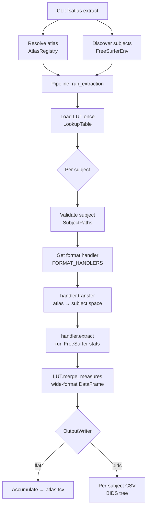

# Architecture

This page describes the internal structure of fsatlas for contributors and users who want to understand how the pipeline works.

---

## Project Layout

```
src/fsatlas/
├── __init__.py              # Package version
├── cli/
│   ├── __init__.py
│   └── main.py              # Click CLI: extract, list-atlases, download, generate-lut
├── atlases/
│   ├── __init__.py
│   ├── catalog.yaml         # Built-in atlas definitions (31 atlases)
│   ├── *_labels.tsv         # Bundled LUT files for volumetric atlases
│   └── registry.py          # AtlasRegistry, AtlasSpec, CustomAtlasSpec
└── core/
    ├── __init__.py
    ├── bids.py              # BIDS path construction for bids output layout
    ├── command.py           # run_command() subprocess wrapper (10 min timeout)
    ├── environment.py       # FreeSurferEnv, SubjectPaths
    ├── extract.py           # FreeSurfer command runners + .stats file parsers
    ├── formats.py           # Format handler registry (annot, nifti, dlabel_gii, gca)
    ├── lut.py               # LookupTable: from_tsv, from_annot, merge_measures
    └── pipeline.py          # run_extraction() orchestrator + FlatWriter/BidsWriter
```

---

## Data Flow


```mermaid
flowchart TD
    A[CLI: fsatlas extract] --> B[Resolve atlas\nAtlasRegistry]
    A --> C[Discover subjects\nFreeSurferEnv]
    B --> D[Pipeline: run_extraction]
    C --> D
    D --> E[Load LUT once\nLookupTable]
    E --> F{Per subject}
    F --> G[Validate subject\nSubjectPaths]
    G --> H[Get format handler\nFORMAT_HANDLERS]
    H --> I[handler.transfer\natlas → subject space]
    I --> J[handler.extract\nrun FreeSurfer stats]
    J --> K[LUT.merge_measures\nwide-format DataFrame]
    K --> L{OutputWriter}
    L -->|flat| M[Accumulate → atlas.tsv]
    L -->|bids| N[Per-subject CSV\nBIDS tree]
```

---

## Module Descriptions

### `cli/main.py` — Command-Line Interface

Built with [Click](https://click.palletsprojects.com/). Provides four user-facing commands:

- **`extract`** — Main command; orchestrates the full pipeline.
- **`list-atlases`** — Displays atlas catalog in a Rich table.
- **`download`** — Pre-downloads atlases to the cache.
- **`generate-lut`** — Extracts the embedded colour table from `.annot` files into a reusable LUT TSV.

Global options:
- `--freesurfer-license-file` — Path to FreeSurfer `license.txt` (also accepts `FS_LICENSE` env var).

Responsibilities:
- Calls `FreeSurferEnv.detect()` to find and validate the FreeSurfer installation.
- Calls `AtlasRegistry` to resolve the atlas (catalog lookup or custom file path).
- Discovers subjects from `$SUBJECTS_DIR`, `-s` flags, or `--subjects-file`.
- Delegates to `run_extraction()`.

---

### `atlases/registry.py` — Atlas Registry

Three classes:

**`AtlasSpec`** — A catalog atlas entry loaded from `catalog.yaml`. Key properties:
- `cache_dir` — `~/.cache/fsatlas/atlases/{name}/`
- `is_downloaded` — checks if files are present in cache
- `get_file(key)` — returns path to a named file in cache
- `labels_tsv_path` — path to the LUT TSV in cache
- `download(force=False, env=None)` — downloads all atlas files + LUT

**`CustomAtlasSpec`** — A user-provided atlas. Stores paths; auto-detects format from extension.

**`AtlasRegistry`** — Loads `catalog.yaml` and manages the catalog:
- `get(name)` — looks up an `AtlasSpec` by ID
- `list_atlases()` — returns all `AtlasSpec` entries
- `download(name, force, env)` — downloads and caches atlas + LUT
- Static factory methods for custom atlases:
  - `from_custom_surface(lh_annot, rh_annot, labels_tsv=None)`
  - `from_custom_volumetric(nifti_path, labels_tsv=None)`
  - `from_custom_dlabel_gii(lh_dlabel, rh_dlabel, labels_tsv=None)`
  - `from_custom_gca(gca_path, labels_tsv=None)`

**Type alias:**
```python
AnyAtlasSpec = AtlasSpec | CustomAtlasSpec
```

---

### `atlases/catalog.yaml` — Atlas Definitions

A YAML file bundled with the package. Each entry specifies:

```yaml
- name: schaefer100-7
  family: Schaefer2018
  description: "100-parcel 7-network Schaefer 2018 atlas"
  format: annot
  space: fsaverage
  source_url: "https://..."
  files:
    lh_annot: lh.Schaefer2018_100Parcels_7Networks_order.annot
    rh_annot: rh.Schaefer2018_100Parcels_7Networks_order.annot
  labels_tsv: labels.tsv
  citation: "Schaefer et al. 2018"
  bids_name: schaefer100x7
```

For FreeSurfer built-ins (`desikan`, `destrieux`, `dkt`, `aseg`): no `source_url`; atlas files are read directly from the subject's `label/` directory.

For atlases not publicly downloadable (e.g. Brainnetome): `local_source_dir` is used instead of `source_url`.

---

### `core/environment.py` — FreeSurfer Environment

**`FreeSurferEnv`**:
- `detect(subjects_dir=None)` — class method; reads `FREESURFER_HOME`, validates installation, detects FS version
- `subjects_dir` — resolves `SUBJECTS_DIR`
- `list_subjects()` — returns valid subject directories (must have `lh.white` + `aseg.mgz`)
- `fsaverage_dir` — path to `fsaverage` in the FS installation
- `find_subject(subject_id)` — returns `SubjectPaths` for a given subject

**`SubjectPaths`**:
- Wraps a single subject directory
- Properties: `surf_dir`, `label_dir`, `mri_dir`, `stats_dir`
- `annot_path(hemi, annot_name)` — path to `{hemi}.{annot_name}.annot`
- `aseg_mgz`, `norm_mgz`, `talairach_xfm`, `talairach_m3z`, `sphere_reg` — key file paths
- `validate()` — checks 8 essential files exist; returns list of missing files

---

### `core/lut.py` — Lookup Table

**`LookupTable`** — canonical mapping from integer region index to label + hemisphere. Every atlas requires a LUT; it drives the output schema.

Constructors:
- `from_tsv(path)` — loads TSV; auto-detects 3 formats (header row, two-column headerless, name-only); auto-infers hemisphere from region name
- `from_annot(lh_annot, rh_annot)` — extracts embedded colour table from `.annot` files via nibabel

Key methods:
- `to_tsv(path)` — write LUT to TSV
- `to_ctab()` — generate FreeSurfer colour table (`.ctab`) for `mri_segstats`
- `merge_measures(raw_stats, subject_id, tiv, measure_map, join_on)` — joins raw extracted stats onto the LUT; returns wide-format DataFrame

**Output schema** (one row per region per subject):
```
subject_id | index | label | hemisphere | [extra LUT columns] | measure1 | ... | tiv_mm3
```

---

### `core/formats.py` — Format Handlers

**Pattern:** Abstract base `AtlasFormatHandler` with four concrete implementations.

```python
class AtlasFormatHandler(ABC):
    format_id: str          # "annot", "nifti", "dlabel_gii", "gca"
    measure_map: dict       # raw column → output column names
    join_on: str            # "label" or "index"

    @abstractmethod
    def transfer(atlas, subject, env, overwrite) -> TransferResult: ...

    @abstractmethod
    def extract(atlas, subject, env, transfer_result, force) -> (DataFrame, tiv): ...
```

**`TransferResult`** carries the paths to transferred atlas files:
- Surface: `{lh: Path, rh: Path}`
- Volumetric: `{volume: Path}`

**Concrete handlers:**

| Handler | Format | Transfer command | Extract command | Measures |
|---------|--------|-----------------|-----------------|----------|
| `AnnotHandler` | `.annot` | `mri_surf2surf` | `mris_anatomical_stats` | 9 cortical |
| `NiftiHandler` | `.nii/.nii.gz` | `mri_vol2vol` | `mri_segstats` | 7 volumetric |
| `DlabelGiiHandler` | `.dlabel.gii` | `mris_convert` + `mri_surf2surf` | via AnnotHandler | 9 cortical |
| `GcaHandler` | `.gca` | `mri_ca_label` | `mri_segstats` | 7 volumetric |

Handler registry:
```python
FORMAT_HANDLERS = {
    "annot": AnnotHandler(),
    "nifti": NiftiHandler(),
    "dlabel_gii": DlabelGiiHandler(),
    "gca": GcaHandler(),
}
```

---

### `core/extract.py` — Stats Extraction

Low-level runners called by the format handlers:

- `_run_anatomical_stats(subject, hemi, atlas_name, annot_path, env)` → `.stats` path
- `_run_segstats(subject, atlas_name, vol_path, ctab_path, env)` → `.stats` path

Parsers:
- `_parse_cortical_stats_file(path)` → DataFrame (StructName + 9 measure columns)
- `_parse_segstats_file(path)` → DataFrame (10 columns from `mri_segstats` output)
- `_parse_etiv_from_header(path)` → eTIV float

---

### `core/command.py` — Subprocess Wrapper

```python
def run_command(cmd: list[str], env: FreeSurferEnv) -> CompletedProcess
```

Sets `FREESURFER_HOME` and `SUBJECTS_DIR` in the subprocess environment. Runs with a 10-minute timeout. Raises `RuntimeError` on non-zero exit with captured stderr.

---

### `core/pipeline.py` — Orchestrator

Single public function:

```python
def run_extraction(
    atlas: AnyAtlasSpec,
    subjects: list[str],
    env: FreeSurferEnv,
    output_dir: Path,
    force: bool = False,
    output_layout: str = "flat",
) -> dict[str, Path]
```

For each atlas run:
1. Loads the LUT once (shared across all subjects).
2. Initialises an `OutputWriter` (`FlatWriter` or `BidsWriter`).
3. For each subject: validate → transfer → extract → merge with LUT → write.
4. Catches per-subject errors; logs to `{atlas}_failures.csv`.

**`FlatWriter`** — accumulates all subjects in memory; writes a single `{atlas}.tsv` at the end.

**`BidsWriter`** — writes a per-subject CSV for each structure (cortical/subcortical) inside a BIDS-like directory tree.

---

### `core/bids.py` — BIDS Path Construction

- `parse_bids_entities(subject_id)` — extracts `sub`/`ses` labels from BIDS-formatted subject IDs; falls back to sanitising non-BIDS IDs.
- `build_bids_path(output_dir, entities, atlas_bids_name, structure)` — builds the full output path:

```
{output_dir}/sub-{sub}/[ses-{ses}/]anat/atlas-{atlas}/sub-{sub}[_ses-{ses}]_atlas-{atlas}_structure-{structure}.csv
```

---

## Caching Strategy

| Cache location | What is cached | Cleared by |
|----------------|---------------|------------|
| `~/.cache/fsatlas/atlases/` | Downloaded atlas files + LUT TSVs | `fsatlas download --force` |
| `{subject}/label/{hemi}.{atlas}.annot` | Transferred surface atlas | `--force` flag |
| `{subject}/mri/atlas/{atlas}.nii.gz` | Transferred volumetric atlas | `--force` flag |

---

## Design Decisions

**Why wide format?**
Wide-format output (one row per region per subject, measures as columns) is immediately usable for common analysis patterns — filtering by region, pivoting to a subjects × regions matrix, or computing ratios. The LUT drives the schema, ensuring every region appears as a row even if the FreeSurfer command returned no data (those cells are `NaN`).

**Why the format-handler pattern?**
Each atlas format (`.annot`, `.nii`, `.dlabel.gii`, `.gca`) requires different FreeSurfer commands for transfer and extraction. Encapsulating this in a handler class keeps `pipeline.py` format-agnostic and makes adding new formats straightforward.

**Why FreeSurfer CLI wrappers instead of Python bindings?**
FreeSurfer's Python bindings are incomplete and version-specific. Wrapping the CLI commands ensures compatibility with any FreeSurfer 8.x installation and makes invocations transparent and debuggable.

**Why nearest-neighbor interpolation for volumetric atlases?**
Atlas labels are integers. Trilinear or sinc interpolation would produce fractional values that map to no valid label. Nearest-neighbor preserves label integrity.

**Why affine (talairach) registration for NIfTI atlases?**
FreeSurfer's `recon-all` computes `talairach.xfm` for every subject as part of the standard workflow. Using it requires no extra processing. For atlases requiring non-linear registration, register externally and pass the native-space result as a custom volumetric atlas. The GCA handler uses `talairach.m3z` (non-linear).
